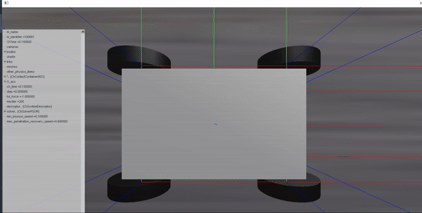

# Multibody Dynamics Simulation

Multibody dynamics simulation of a simple four-wheeled vehicle using the 
[PyChrono](https://projectchrono.org/pychrono/) library.

Further details are available [here](https://cristianopizzamiglio.com/2024/10/12/mbd-pychrono.html).

